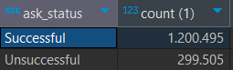

# Solución de Facturación Automatizada para Empresas Financieras


## Descripción

En un entorno financiero donde la precisión y la eficiencia son factores clave, **BATSEJ OPEN FINANCE S.A** ofrece soluciones para la verificación de cuentas bancarias activas a través de APIs, mejorando la confianza, previniendo fraudes y proporcionando un servicio seguro y eficiente.

Esta solución automatiza el proceso de facturación y el envío de resultados a las empresas que utilizan estas APIs. Los datos son extraídos desde una base de datos **SQLite**, procesados aplicando las reglas de negocio de cada empresa, y se generan reportes personalizados para los meses de **julio y agosto de 2024**, enviando los resultados directamente por correo electrónico con los detalles adjuntos en un archivo **.xlsx**.

## Contexto

Las organizaciones financieras, como **BATSEJ OPEN FINANCE S.A**, buscan mejorar su **Retorno de Inversión (ROI)** manteniendo operaciones eficientes sin comprometer la experiencia del cliente. En este contexto:

- **BATSEJ OPEN FINANCE S.A** compra bases de datos a otras entidades financieras y ofrece a sus clientes la capacidad de verificar cuentas bancarias activas a través de **APIs**.
- El proceso automatizado de verificación de cuentas previene fraudes, reduce errores humanos y acelera las operaciones.
- **El cobro de comisiones** por el uso de las APIs asegura la rentabilidad y eficiencia en el uso de los recursos.

## Solución Técnica

### 1. Extracción de datos desde SQLite
- Los datos son extraídos de dos tablas principales: `APICALL` y `COMMERCE`, las cuales son combinadas mediante una consulta SQL que genera la **CTE (Common Table Expression)** llamada `CTE_FINAL`.
- Se utilizó **DBeaver** como cliente SQL para construir el script.

### 2. Procesamiento en SQL y Python
- Se implementaron soluciones tanto en SQL como en Python para replicar la lógica de negocio y calcular el valor total por empresa.
- Se calculan comisiones basadas en llamadas exitosas (`Successful`) y no exitosas (`Unsuccessful`) a las APIs.

### 3. Reglas de Negocio
Cada empresa tiene un esquema de facturación diferente:
- **Tarifas fijas** por petición exitosa (Ej.: **Innovexa Solutions**, **QuantumLeap Inc**).
- **Tarifas variables** según volumen de peticiones (Ej.: **NexaTech Industries**, **FusionWave Enterprises**).
- **Descuentos** cuando las peticiones no exitosas superan umbrales (Ej.: **Zenith Corp**).

### 4. Generación del DataFrame en Python
- Utilizando `sqlite3`, se ejecuta la consulta SQL y los datos se almacenan en un **DataFrame**.
- El **DataFrame** se procesa para calcular comisiones, IVA y valores totales, aplicando las reglas de negocio correspondientes.

### 5. Filtrado por estatus activo
- Solo se incluyen empresas cuyo **estatus** es **'Activo'**, asegurando que la facturación se genere para empresas operativas.
- Los resultados se filtran para los meses de **julio y agosto de 2024**.

### 6. Automatización del Envío de Correos
- Se genera un archivo **.xlsx** con los resultados de facturación y se envía por correo electrónico utilizando **Microsoft Outlook** con la biblioteca `win32com.client`.


## Instalación y Requisitos

### Requisitos Previos
- **Python 3.x**: [https://www.python.org/downloads/](https://www.python.org/downloads/)
- **SQLite**: [https://www.sqlite.org/index.html](https://www.sqlite.org/index.html)
- **Microsoft Outlook** configurado en tu máquina.
- **DBeaver** (opcional para manipular la base de datos).

### Dependencias en Python
Instala las dependencias necesarias ejecutando:

```bash
pip install pandas pywin32 sqlite3
```
## Configuración

### Base de Datos SQLite

- Se debe asegurar de que la base de datos **SQLite** esté correctamente configurada con las tablas `APICALL` y `COMMERCE`.
- Estas tablas contienen los datos de las llamadas API y la información de los comercios.

### Microsoft Outlook

- Es imprescindible que **Microsoft Outlook** esté instalado y configurado para que el envío de correos electrónicos automáticos funcione.
- El script utiliza la biblioteca `win32com.client` para enviar correos electrónicos directamente desde Outlook.

## Estructura del Proyecto

```bash
├── data/                            # Carpeta para almacenar la base de datos SQLite
├── facturas_resultado/              # Carpeta donde se guardan los archivos .xlsx generados
├── media/                           # Carpeta el cual contiene imagenes de analisis descriptivo de los campos de las tablas APICALL y COMMERCE
├── main.py                          # Script principal de Python
└── README.rmd                       # Este archivo, que documenta el proyecto en formato RMarkdown
```

## Diccionario de Datos de la Tabla `APICALL`

| Nombre de la Columna | Tipo de Dato       | Descripción                                                                                 |
|----------------------|--------------------|---------------------------------------------------------------------------------------------|
| `date_api_call`      | **DATETIME**        | Fecha y hora en que se realizó la llamada a la API.                                          |
| `commerce_id`        | **VARCHAR** (String)| Identificador único del comercio que realizó la llamada a la API.                            |
| `ask_status`         | **VARCHAR** (String)| Estado de la llamada a la API, puede ser `Successful` o `Unsuccessful`.                      |
| `is_related`         | **INTEGER**         | Indica si la llamada está relacionada a una petición previa. Valores: `1` (Relacionado), `0` (No relacionado), o `NULL` si no aplica. |

## Diccionario de Datos de la Tabla `COMMERCE`

| Nombre de la Columna | Tipo de Dato       | Descripción                                                                                 |
|----------------------|--------------------|---------------------------------------------------------------------------------------------|
| `commerce_id`        | **VARCHAR** (String)| Identificador único del comercio.                                                           |
| `commerce_nit`       | **NUMERIC**         | Número de identificación tributaria (NIT) del comercio.                                     |
| `commerce_name`      | **VARCHAR** (String)| Nombre del comercio.                                                                        |
| `commerce_status`    | **VARCHAR** (String)| Estado del comercio (`Active` para comercios activos o `Inactive` para inactivos).           |
| `commerce_email`     | **VARCHAR** (String)| Correo electrónico del comercio utilizado para las notificaciones.                          |

## Análisis Descriptivo de los Campos

Se realizó un conteo de la cantidad de registros según los campos categóricos presentes en las tablas `APICALL` y `COMMERCE`.


### Campo `ASK_STATUS`



### Campo `IS_RELATED`


### Campo `COMMERCE_NAME`


### Campo `COMMERCE_STATUS`


